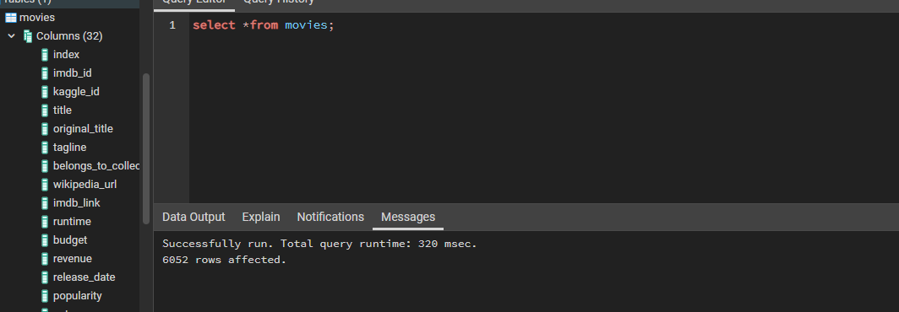
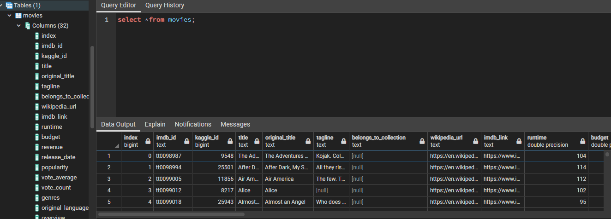
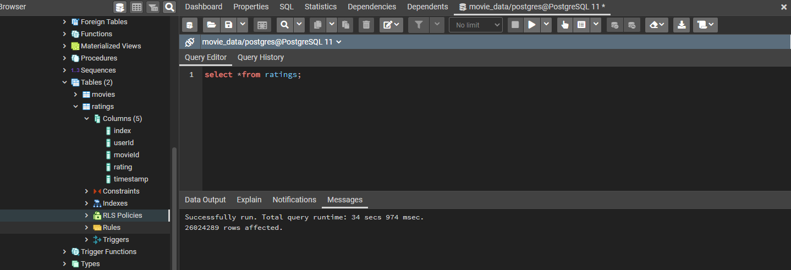
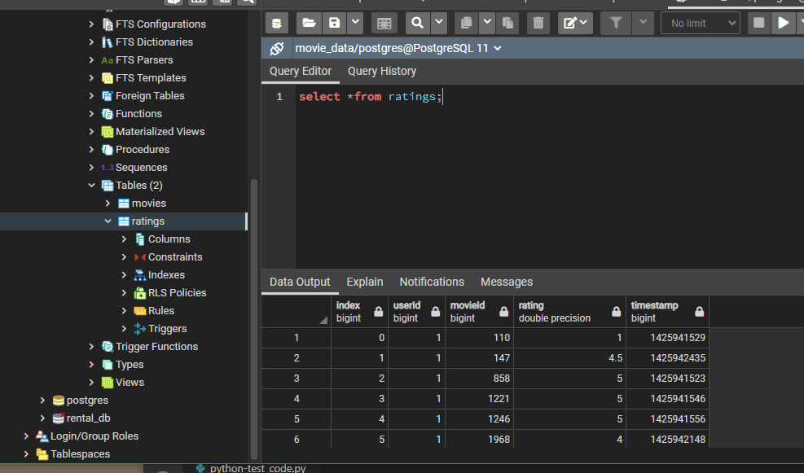

#  _What's Next In The Queue?_ || Amazing Prime Video, Extract, Transform, and Load Analysis

## Overview of Project

Amazing Prime Video Team would like to develop an algorithm that will automate a data pipeline for movies slated, primarily low-budget movies, for release so in turn, they can plan to purchase the streaming rights.

To boost morale amongst the team and connect with the local coding community, Amazing Prime Video has decided to host a hackathon. Only except the data needed, requires some extensive _"wrangling"_ for participants use.

An extract, transform, and load (or ETL) analysis was performed to scrape, clean, and present the former dataset into two separate uniformed SQL database of over 6,000 movies releases and 26 million reviews/ratings since 1990.

## Resources
* Data Sources: Wikipedia (movie) data, Kaggle metadata, MovieLens rating data

* Software: Visual Studio Code, 1.52. 1 | Python 3.7.6 64-bit  | Python Libaries: Pandas, Numpy, Regular Expression (RegEX), Pacakage(s): psycopg2-binary | Microsoft Excel | PostgreSQL, 11 | pgAdmin, 4.29 | Jupyter Notebook** 

    * Data Access: Workaround, [Project Jupyter: jupyter nbviewer](https://nbviewer.jupyter.org/), a Jupytner Notebook renderer **
     * Data may not display properly on GitHub, please use provided workaround

## Summary
Successfully, created an automated script that can be used to routinely pull data at desired frequency, i.e., daily.

As seen, capture images of _**"movie_data"**_ database creation, with subsequent tables.

  <i><b>"movies" Table/Database, PostgreSQL</b></i> 
 

  

  <i><b>"movies" Table/Database, PostgreSQL, Output</b></i> 
 

  

  <i><b>"ratings" Table/Database, PostgreSQL</b></i> 
 

  

  <i><b>"ratings" Table/Database, PostgreSQL, Output</b></i> 
 

  

***

#### Author

_Whitney D. Gardner_
